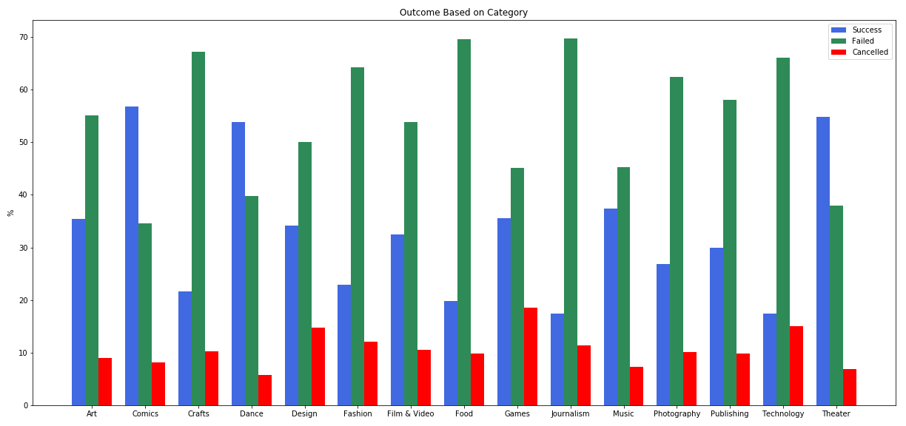

# Final Project for the Visualization Class
I have done an exploratory analysis on Twitter data collected by a Kaggle user. I have breakdown successful campaigns and tried to identify shared characteristics.

